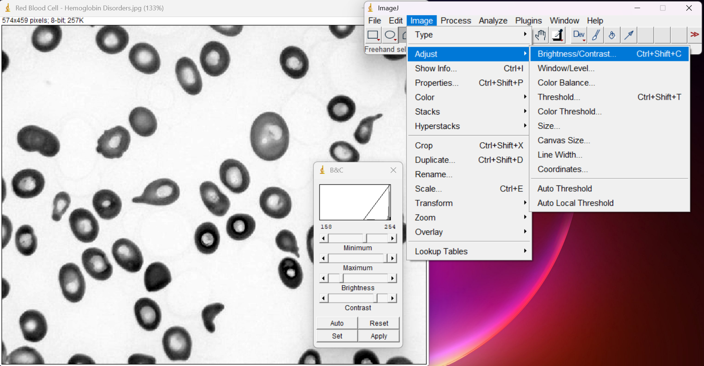
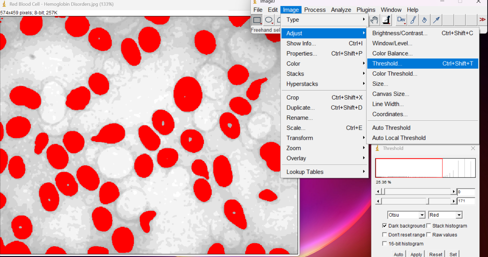
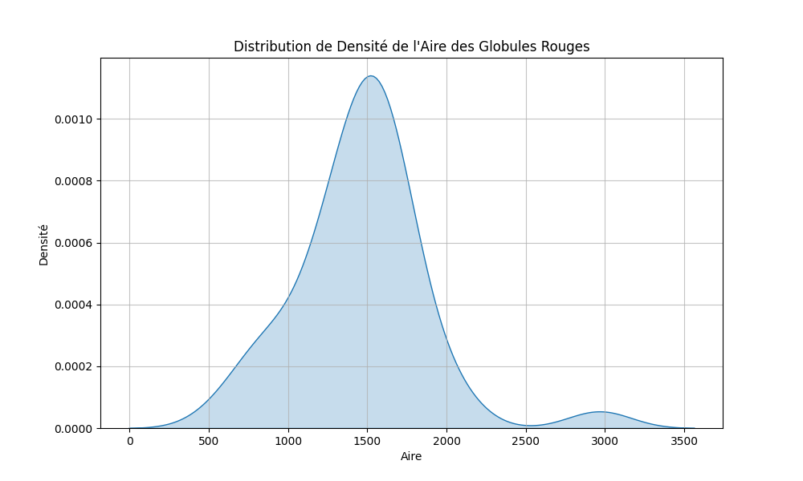
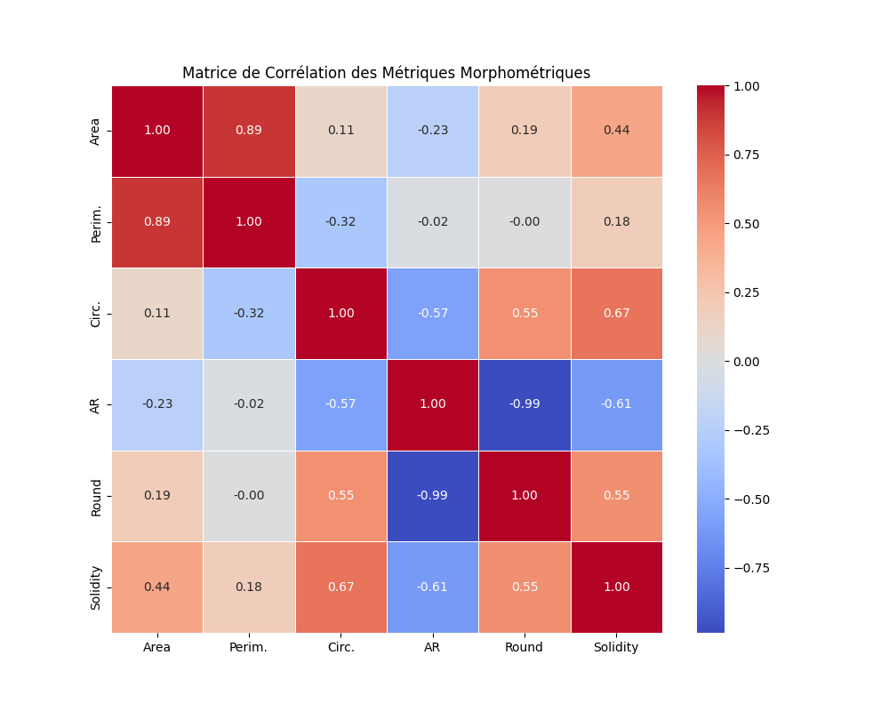

# 🧬 Quantitative Imaging Analysis of RBC Morphology  
### using ImageJ (Fiji) & Python

> A reproducible computational biology pipeline for automated Red Blood Cell (RBC) morphometry integrating image segmentation and statistical modeling.

---

## 📌 Project Overview

This repository presents a hybrid **computational hematology pipeline** designed to reduce subjectivity in manual RBC morphological assessment.

The workflow integrates:

- **ImageJ/Fiji** for automated image segmentation  
- **Python (Pandas / NumPy / Seaborn / Matplotlib)** for statistical modeling and visualization  

The objective is to quantify:

- **Anisocytosis** (size variation)  
- **Poikilocytosis** (shape variation)  

across two biological contexts:

| Sample Type | Description |
|-------------|------------|
| 🩸 Normal Human RBCs | Baseline healthy distribution |
| 🐶 Canine Regenerative Anemia | Pathological sample with anisocytosis, macrocytosis & polychromasia |

> [!NOTE]  
> The original work report was written in French.  
> This repository provides an English-language overview and the full computational pipeline for international accessibility.

---

# 🏛 Institutional Affiliation

| Institution | Faculty | Department |
|-------------|---------|------------|
|  <br> Université des Sciences et de la Technologie Houari Boumediene (USTHB) |  <br> Faculty of Biological Sciences | Department of Biology & Organism Physiology |


---

# 🛠 Technical Stack

| Component | Tool / Library | Purpose |
|------------|---------------|----------|
| Image Processing | ImageJ / Fiji (v1.54+) | Preprocessing, segmentation, metric extraction |
| Statistical Analysis | Python (Google Colab) | Cloud-based data modeling |
| Data Handling | Pandas / NumPy | Data manipulation |
| Visualization | Seaborn / Matplotlib | KDE plots, heatmaps, correlation matrices |

---

---

# 🧬 Analysis Pipeline

The project follows a hybrid computational architecture combining high-precision image segmentation with reproducible statistical modeling.

---

## Phase 1 — ImageJ Workflow (Segmentation)

### 1️⃣ Preprocessing

Each microscopy image undergoes standardized preprocessing:

- **Conversion to 8-bit** – Standardizes intensity dynamic range for thresholding.  
- **Gaussian Blur (σ = 1.0)** – Reduces high-frequency noise while preserving cellular edges.  
- **Rolling Ball Background Subtraction (50 px)** – Corrects uneven illumination artifacts.



---

### 2️⃣ Segmentation & Masking

Adaptive thresholding is applied depending on sample type:

| Sample Type        | Thresholding Method     | Rationale |
|--------------------|------------------------|-----------|
| Healthy RBCs      | Global Otsu            | Uniform opacity |
| Pathological RBCs | Triangle Adaptive      | Variable staining |

#### Watershed Algorithm

Applied to separate overlapping cells into individual measurable objects.


---

### 3️⃣ Feature Extraction

Automated extraction of morphometric descriptors:

- Area  
- Circularity  
- Aspect Ratio  
- Roundness  
- Mean Gray Value  

All measurements are exported as structured `.csv` datasets.

## Example CSV Structure

```csv
Image_ID,Cell_ID,Area,Circularity,Aspect_Ratio,Roundness,Mean_Gray
Normal_01,1,56.21,0.93,1.05,0.89,132.4
Normal_01,2,60.78,0.91,1.12,0.87,129.8
```


## Phase 2 — Python Statistical Modeling

The extracted `.csv` datasets from ImageJ are processed in Python to derive quantitative biological insights about RBC morphology.

---

### KDE Analysis — Quantifying Anisocytosis

Kernel Density Estimation (KDE) is used to model the continuous probability distribution of cell areas. This allows:

- Statistical comparison between healthy and pathological RBC populations  
- Detection of macrocytosis shifts  
- Quantification of variance expansion in cell sizes  



---

### Correlation Heatmaps

Correlation matrices are generated to validate the reliability of morphometric descriptors.

Example observation:

**Circularity vs Aspect Ratio ≈ -0.84**  

This confirms geometric consistency and robustness of extracted features.




---

### Outlier Detection

Automated filtering removes unwanted data points such as:

- Staining artifacts  
- Non-cellular debris  
- Extreme measurement noise  

This ensures that statistical analyses are robust and reproducible.

---

### Python Libraries Used

| Library      | Purpose |
|-------------|---------|
| `pandas`    | Tabular data handling and manipulation |
| `numpy`     | Numerical operations and arrays |
| `scipy`     | Statistical tests and KDE |
| `matplotlib`| Basic plotting |
| `seaborn`   | Advanced visualizations (heatmaps, KDE) |

---

### Example Python Workflow

```python
import pandas as pd
import seaborn as sns
import matplotlib.pyplot as plt

# Load CSV
data = pd.read_csv('data/normal_sample.csv')

# KDE Plot
sns.kdeplot(data['Area'], shade=True)
plt.title('RBC Area Distribution - Normal Sample')
plt.show()

# Correlation Heatmap
corr = data[['Area','Circularity','Aspect_Ratio','Roundness']].corr()
sns.heatmap(corr, annot=True, cmap='coolwarm')
plt.title('Correlation Heatmap of RBC Morphometric Features')
plt.show()
```

## Phase 3 — Advanced Analysis & Post-processing

After initial segmentation (Phase 1) and statistical modeling (Phase 2), Phase 3 focuses on **high-level biological interpretation and reproducible reporting**.

---

### 1️⃣ Outlier & Artifact Management

- Identify extreme morphometric values beyond biological plausibility  
- Remove debris, noise, or improperly segmented objects  
- Ensure statistical robustness for downstream analyses


---

### 2️⃣ Comparative Analysis Between Groups

- Compare **Normal vs Pathological RBCs**  
- Generate side-by-side KDE plots and correlation matrices  
- Quantify **anisocytosis, poikilocytosis, and macrocytosis**  
- Highlight shifts in mean, variance, and shape descriptors


---

### 3️⃣ Visualization & Reporting

- Generate **publication-ready figures**: KDE plots, heatmaps, scatter plots  
- Export cleaned CSV datasets for reproducibility  
- Provide **interactive Jupyter notebook** for full workflow demonstration

---

# 🎓 Author & Supervision
## Author: Abdelkarim Hani Ghrieb Master 1 in Developmental Genetics (USTHB) & CS Student (UoPeople)
### Supervised by: M. Ammar Rachad Medjdoub Open Source Discipline, USTHB.

# 🙏 Acknowledgments
I would like to express my deepest gratitude to my professor, M. Ammar Rachad Medjdoub, for his expert supervision, constant availability, and the high quality of guidance provided throughout the development of this project.
